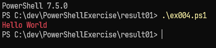
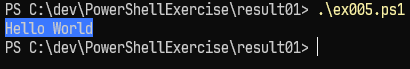

[PowerShell100本ノック　1～10](https://note.com/mahalo_/n/ne1d40940d106)  

# １．Hello World
Hello Worldと表示するプログラムを作成せよ  
[ex001.ps1](ex001.ps1)
```
PS C:\dev\PowerShellExercise\result01> .\ex001.ps1
Hello World
```

# ２．Hello World改行  
Helloを表示し、改行して続けてWorldと表示するプログラムを作成せよ。  
[ex002.ps1](ex002.ps1)
```
PS C:\dev\PowerShellExercise\result01> .\ex002.ps1
Hello
World
```

# ３．Hello World改行なし
Write-Host を2行使い「Hello」と「World」を別々に表示しなさい。ただし改行しないプログラムを作成せよ。  
[ex003.ps1](ex003.ps1)
```
PS C:\dev\PowerShellExercise\result01> .\ex003.ps1
HelloWorld
```

# ４．Hello World　文字色
Hello Worldと赤色で表示するプログラムを作成せよ。  
[ex004.ps1](ex004.ps1)
```
PS C:\dev\PowerShellExercise\result01> .\ex004.ps1
Hello World
```
コードブロックでは色を表現できないので、画像で結果を掲載  


# ５．Hello World　背景色
背景を青色でHello Worldと表示するプログラムを作成せよ。  
[ex005.ps1](ex005.ps1)
```
PS C:\dev\PowerShellExercise\result01> .\ex005.ps1
Hello World
```
コードブロックでは色を表現できないので、画像で結果を掲載  


# ６．コメント
Hello Worldと表示するプログラムに「Hello Worldと表示する」とコメント文を書き込んだプログラムを作成せよ。  
[ex006.ps1](ex006.ps1)
```
PS C:\dev\PowerShellExercise\result01> .\ex006.ps1
Hello World
```

# ７．四則演算
123と456、それらの値の和、差、掛け算、割り算、余りを求めるプログラムを作成せよ。  
[ex007.ps1](ex007.ps1)
```
PS C:\dev\PowerShellExercise\result01> .\ex007.ps1
123 + 456 = 579
123 - 456 = -333
123 * 456 = 56088
123 / 456 = 0.269736842105263
```

# ８．変数足し算
変数$aに10、変数$bに3を入れて$aと$bを足し算して表示するプログラムを作成せよ  
[ex008.ps1](ex008.ps1)
```
PS C:\dev\PowerShellExercise\result01> .\ex008.ps1
$a + $b = 13
```

# ９．変数連結
変数$aに”Fizz”、変数$bに100を入れて$aと$bを連結させて表示するプログラムを作成せよ  
[ex009.ps1](ex009.ps1)
```
PS C:\dev\PowerShellExercise\result01> .\ex009.ps1
Fizz100
```

# １０．書式付き表示
変数$aに数値123を代入し、頭に0を付けて5桁で表示するプログラムを作成せよ  
[ex010.ps1](ex010.ps1)
```
PS C:\dev\PowerShellExercise\result01> .\ex010.ps1
00123
```